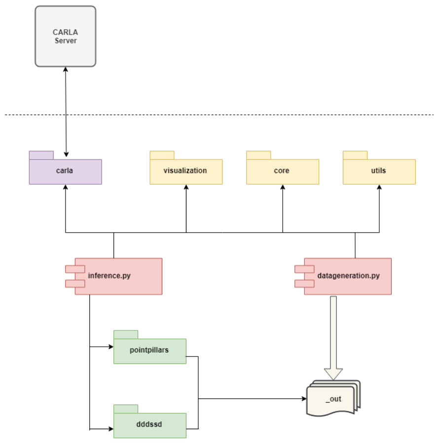
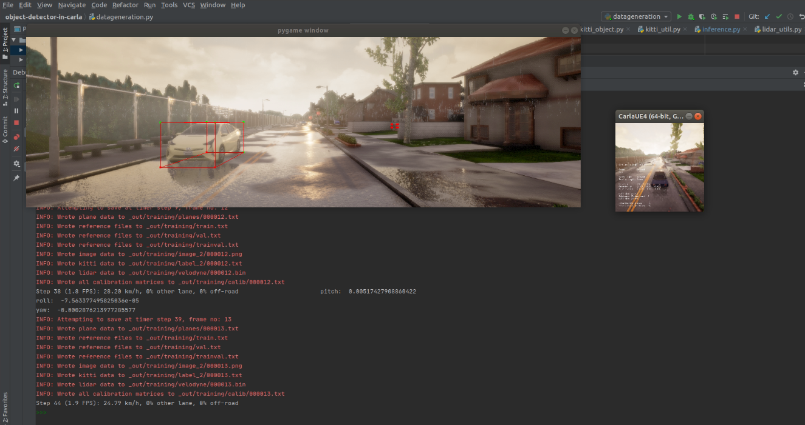
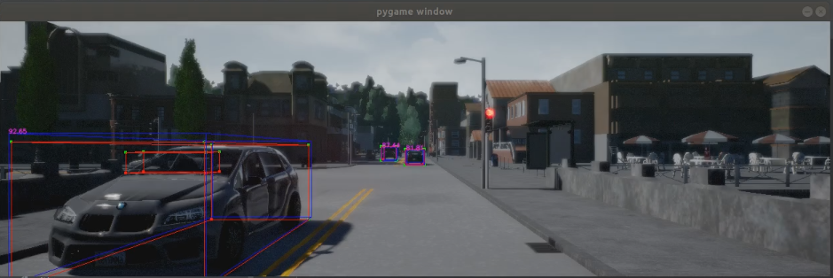

# Object-Detector-In-CARLA
This repository contains code used to generate a dataset (34736 training and 8406 testing samples) 
using [**CADET**](https://github.com/Ozzyz/carla-data-export), to train [**PointPillars**](https://github.com/nutonomy/second.pytorch) 
and [**3DSSD**](https://github.com/Jia-Research-Lab/3DSSD) neural networks on it, and to make real-time predictions in
 [**CARLA simulator**](https://github.com/carla-simulator/carla).




## Generate dataset
[**CADET**]() is used for generate samples from CARLA Simulator in KITTI format.
For more detailed instructions see [CARLA_DATA_EXPORT](CARLA_DATA_EXPORT.md).



Script:
```
python datageneration.py --autopilot
```

## Train
Training supports PointPillars and 3DSSD, but new methods can be integrated easily.
For more detailed instructions regarding te environment see [PointPillars](pointpillars/README.md) and [3DSSD](dddssd/README.md).

## Inference



CARLA simulator needs to be running in server-mode:
```
./CarlaUE4.sh -carla-server -fps=10 -windowed -ResX=200 -ResY=200
``` 
For PointPillars inference run:
```
python inference_pp.py --autopilot
```

For 3DSSD inference run:
```
python inference_3dssd.py --autopilot
```
